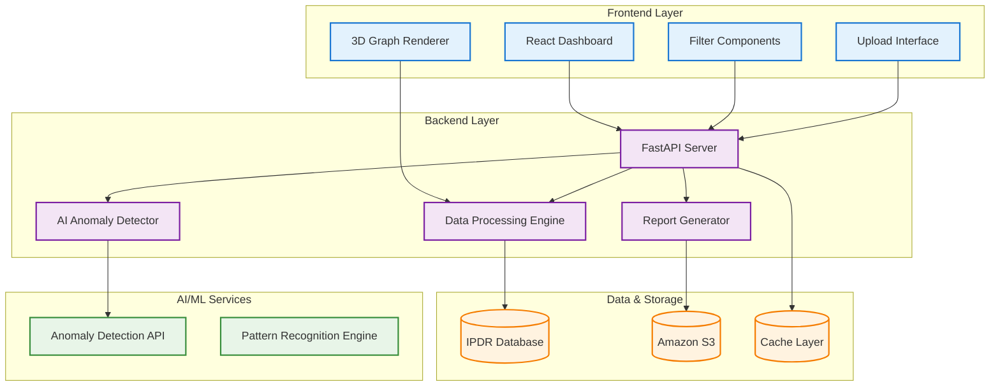

# 🔍 IPDR Intelligence Platform

> **CII Hackathon 2025** | **VIT Bhopal** | **Team: [Your Team Name]**

[](https://opensource.org/licenses/MIT)
[](https://reactjs.org/)
[](https://www.typescriptlang.org/)
[](https://threejs.org/)
[](https://fastapi.tiangolo.com/)

## 📋 Table of Contents
- [🎯 Problem Statement](#-problem-statement)
- [💡 Solution Overview](#-solution-overview)
- [✨ Key Features](#-key-features)
- [🏗️ System Architecture](#️-system-architecture)
- [🛠️ Technology Stack](#️-technology-stack)
- [🚀 Quick Start](#-quick-start)
- [📖 Usage Guide](#-usage-guide)
- [🎨 Screenshots](#-screenshots)
- [👥 Team Members](#-team-members)
- [🔮 Future Enhancements](#-future-enhancements)
- [📄 License](#-license)

---

## 🎯 Problem Statement

In today's digital landscape, **telecommunication networks generate massive amounts of IPDR (Internet Protocol Detail Record) data** containing critical information about user activities, network usage patterns, and potential security threats. However, traditional analysis methods are:

- ❌ **Overwhelming**: Millions of records make manual analysis impossible
- ❌ **Inefficient**: Time-consuming data processing and visualization
- ❌ **Limited**: Lack of real-time anomaly detection capabilities
- ❌ **Inaccessible**: Complex data not understandable by non-technical stakeholders

**The Challenge**: How can we transform complex IPDR data into actionable intelligence that security analysts, network administrators, and decision-makers can easily understand and act upon?

---

## 💡 Solution Overview

**IPDR Intelligence Platform** is a cutting-edge web application that revolutionizes IPDR data analysis through:

🎯 **Interactive 3D Visualization** - Transform complex network data into intuitive 3D graphs
🤖 **AI-Powered Anomaly Detection** - Real-time identification of suspicious activities
📊 **Advanced Filtering & Search** - Drill down into specific data segments
📱 **Responsive Design** - Seamless experience across all devices
📄 **Automated Report Generation** - Professional PDF reports with insights

---

## ✨ Key Features

### 🔍 **Advanced Data Visualization**
- **3D Network Graph**: Interactive visualization of IP-to-IP connections
- **Real-time Rendering**: Smooth performance with large datasets
- **Color-coded Nodes**: Visual distinction between normal and anomalous activities
- **Dynamic Interactions**: Click, hover, and zoom capabilities

### 🧠 **AI-Powered Analytics**
- **Machine Learning Models**: Sophisticated anomaly detection algorithms
- **Real-time Analysis**: Instant processing of uploaded data
- **Confidence Scoring**: Quantified anomaly probabilities
- **Pattern Recognition**: Automated identification of suspicious patterns

### 🎛️ **Intelligent Filtering**
- **Multi-dimensional Search**: Filter by IP, phone, protocol, time, and data volume
- **Real-time Updates**: Instant results as you type
- **Saved Filters**: Persistent filter configurations
- **Export Capabilities**: Filtered data export options

### 📊 **Comprehensive Reporting**
- **Automated PDF Generation**: Professional reports with visualizations
- **Custom Analysis**: Tailored insights for specific use cases
- **Cloud Storage**: Secure report storage and sharing
- **Download Links**: Easy access to generated reports

---

## 🏗️ System Architecture



---

## 🛠️ Technology Stack

### 🎨 **Frontend**
- **React 18** - Modern component-based UI framework
- **TypeScript** - Type-safe JavaScript development
- **Three.js** - 3D graphics and visualization
- **Tailwind CSS** - Utility-first CSS framework
- **Framer Motion** - Smooth animations and transitions
- **React Force Graph** - Network graph visualization

### ⚙️ **Backend**
- **FastAPI** - High-performance Python web framework
- **Python 3.8+** - Core programming language
- **Pandas** - Data manipulation and analysis
- **Scikit-learn** - Machine learning algorithms
- **ReportLab** - PDF generation library

### ☁️ **Infrastructure**
- **Amazon S3** - Cloud storage for reports
- **RESTful APIs** - Clean API design
- **JSON** - Data interchange format
- **Docker** - Containerization support

---

## 🚀 Quick Start

### 📋 Prerequisites
- Node.js 18+ and npm
- Python 3.8+ and pip
- Git

### ⚡ Installation

1. **Clone the Repository**
   ```bash
   git clone https://github.com/Nithin9585/ipdr-vsr.git
   cd ipdr-vsr
   ```

2. **Setup Frontend**
   ```bash
   # Install dependencies
   npm install

   # Start development server
   npm run dev
   ```

3. **Setup Backend**
   ```bash
   # Create virtual environment
   python -m venv venv
   source venv/bin/activate  # On Windows: venv\Scripts\activate

   # Install dependencies
   pip install -r requirements.txt

   # Start FastAPI server
   python main.py
   ```

4. **Access the Application**
   - Frontend: `http://localhost:5173`
   - Backend API: `http://localhost:8000`
   - API Documentation: `http://localhost:8000/docs`

---

## 📖 Usage Guide

### 📤 **Data Upload**
1. Click **"Upload CSV"** in the sidebar
2. Select your IPDR CSV file
3. Wait for automatic parsing and validation
4. View confirmation with record count

### 🔍 **Data Exploration**
1. **Navigate the 3D Graph**: Use mouse to rotate, zoom, and pan
2. **Click Nodes**: View detailed information about IP connections
3. **Apply Filters**: Use sidebar filters to focus on specific data
4. **Search**: Find specific IPs, phones, or protocols

### 🤖 **Anomaly Detection**
1. Click **"Analyze"** button
2. Wait for AI processing (usually 10-30 seconds)
3. View highlighted anomalous nodes in **red**
4. Click anomalous nodes for detailed analysis

### 📊 **Report Generation**
1. Select nodes of interest
2. Click **"Generate Report"**
3. Choose analysis parameters
4. Download PDF report when ready

---

## 🎨 Screenshots

### 🏠 **Dashboard Overview**


### 📈 **3D Network Visualization**


### 🔍 **Anomaly Detection Results**


### 📱 **Mobile Responsive Design**


---

## 👥 Team Members

| Name | Role | GitHub | LinkedIn |
|------|------|--------|----------|
| **[Team Lead Name]** | Full Stack Developer | [@username](https://github.com/username) | [LinkedIn](https://linkedin.com/in/username) |
| **[Member 2]** | AI/ML Engineer | [@username](https://github.com/username) | [LinkedIn](https://linkedin.com/in/username) |
| **[Member 3]** | Frontend Developer | [@username](https://github.com/username) | [LinkedIn](https://linkedin.com/in/username) |
| **[Member 4]** | Backend Developer | [@username](https://github.com/username) | [LinkedIn](https://linkedin.com/in/username) |

**Institution**: VIT Bhopal
**Department**: [Your Department]
**Year**: [Your Year]

---

## 🔮 Future Enhancements

### 🚀 **Phase 2 Features**
- [ ] **Real-time Streaming**: Live IPDR data processing
- [ ] **Advanced AI Models**: Deep learning for pattern recognition
- [ ] **Predictive Analytics**: Forecast network anomalies
- [ ] **Multi-tenant Support**: Enterprise-level user management

### 🎯 **Technical Improvements**
- [ ] **WebSocket Integration**: Real-time data updates
- [ ] **Progressive Web App**: Offline functionality
- [ ] **Advanced Visualizations**: Heat maps and time-series charts
- [ ] **API Rate Limiting**: Enhanced security and performance

### 🔧 **Infrastructure Scaling**
- [ ] **Microservices Architecture**: Modular system design
- [ ] **Kubernetes Deployment**: Container orchestration
- [ ] **CI/CD Pipeline**: Automated testing and deployment
- [ ] **Monitoring & Logging**: Comprehensive system observability

---

## 📄 License

This project is licensed under the **MIT License** - see the [LICENSE](LICENSE) file for details.

---

## 🙏 Acknowledgments

- **CII Hackathon 2025** for providing this amazing platform
- **VIT Bhopal** for hosting and supporting innovation
- **Open Source Community** for the amazing tools and libraries
- **Mentors and Judges** for their guidance and feedback

---

## 📞 Contact

**Project Repository**: [GitHub](https://github.com/Nithin9585/ipdr-vsr)
**Demo Video**: [YouTube](https://youtube.com/watch?v=demo-link)
**Live Demo**: [Vercel/Netlify Deployment](https://your-demo-link.com)

**For questions or collaboration opportunities:**
- 📧 Email: [your-team-email@vitbhopal.ac.in]
- 💬 Discord: [Your Discord Server]
- 📱 WhatsApp: [+91 XXXXX XXXXX]

---

<div align="center">

**Made with ❤️ by Team [Your Team Name]**

**CII Hackathon 2025** | **VIT Bhopal**

⭐ **Don't forget to star this repository if you found it helpful!** ⭐

</div>
