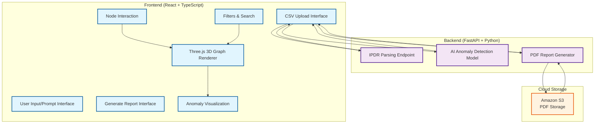

```mermaid
graph TB
    %% Frontend Components
    subgraph "Frontend (React + TypeScript)"
        A[CSV Upload Interface]
        B[User Input/Prompt Interface]
        C[Generate Report Interface]
        D[Three.js 3D Graph Renderer]
        E[Filters & Search]
        F[Anomaly Visualization]
        G[Node Interaction]
    end

    %% Backend Components
    subgraph "Backend (FastAPI + Python)"
        H[IPDR Parsing Endpoint]
        I[AI Anomaly Detection Model]
        J[PDF Report Generator]
    end

    %% External Services
    subgraph "Cloud Storage"
        K[Amazon S3<br/>PDF Storage]
    end

    %% Connections
    A --> H
    H --> A
    D --> F
    A --> I
    I --> A
    A --> J
    J --> K
    K --> J
    J --> A
    G --> D
    E --> D

    %% Styling
    classDef frontend fill:#e1f5fe,stroke:#01579b,stroke-width:2px
    classDef backend fill:#f3e5f5,stroke:#4a148c,stroke-width:2px
    classDef cloud fill:#fff3e0,stroke:#e65100,stroke-width:2px

    class A,B,C,D,E,F,G frontend
    class H,I,J backend
    class K cloud
```
