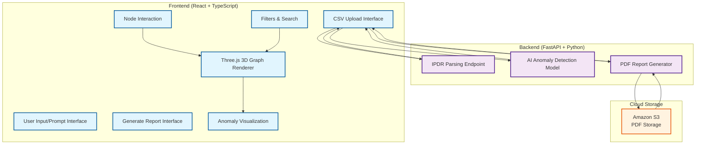

# IPDR Intelligence Platform

## System Architecture



## Features

### 🎯 Core Functionality
- **IPDR Data Visualization**: Interactive 3D graph showing A-to-B mappings
- **Anomaly Detection**: AI-powered analysis with red highlighting for suspicious activities
- **Real-time Filtering**: Search and filter by IP, phone, protocol, bytes, duration, and date
- **Node Details**: Tap any node to view IP, phone number, location, and session count
- **PDF Report Generation**: Generate detailed analysis reports for selected nodes

### 🔧 Technical Features
- **Responsive Design**: Works on desktop and mobile devices
- **Modern UI**: Clean, professional interface with dark/light theme support
- **Performance Optimized**: Efficient rendering of large datasets
- **Real-time Updates**: Live anomaly detection and visualization
- **Export Capabilities**: PDF reports with comprehensive analysis

## Technology Stack

### Frontend
- **React 18** with TypeScript
- **Three.js** for 3D graph rendering
- **Tailwind CSS** for styling
- **Framer Motion** for animations
- **React Force Graph** for network visualization

### Backend
- **FastAPI** (Python)
- **AI/ML Models** for anomaly detection
- **PDF Generation** libraries
- **Data Processing** pipelines

### Infrastructure
- **Amazon S3** for file storage
- **RESTful APIs** for communication
- **JSON** data interchange

## Getting Started

### Prerequisites
- Node.js 18+
- Python 3.8+
- npm or yarn

### Installation

1. **Clone the repository**
   ```bash
   git clone https://github.com/Nithin9585/ipdr-vsr.git
   cd ipdr-vsr
   ```

2. **Install frontend dependencies**
   ```bash
   npm install
   ```

3. **Install backend dependencies**
   ```bash
   pip install -r requirements.txt
   ```

4. **Start the development server**
   ```bash
   npm run dev
   ```

5. **Start the backend server**
   ```bash
   python main.py
   ```

## Usage

1. **Upload IPDR CSV**: Use the upload interface to import your IPDR data
2. **Visualize Data**: View the interactive 3D graph with nodes and connections
3. **Apply Filters**: Use search and filter options to focus on specific data
4. **Detect Anomalies**: Run AI analysis to identify suspicious activities
5. **Generate Reports**: Create PDF reports for selected nodes or custom analysis

## Data Flow

1. **CSV Upload** → IPDR Parsing → Data Visualization
2. **User Interaction** → Node Selection → Detail View
3. **Anomaly Analysis** → AI Processing → Visual Highlighting
4. **Report Generation** → PDF Creation → S3 Storage → Download Link

## Contributing

1. Fork the repository
2. Create a feature branch
3. Make your changes
4. Submit a pull request

## License

This project is licensed under the MIT License - see the LICENSE file for details.