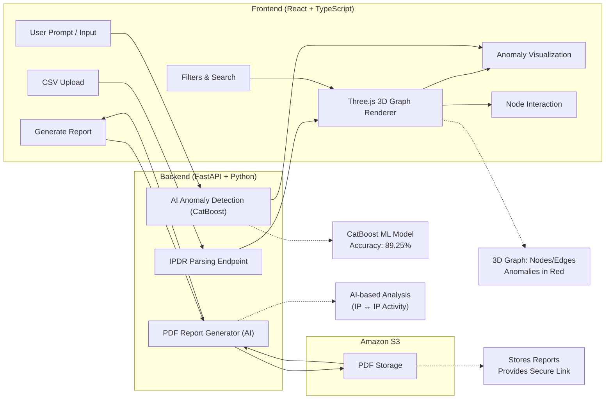

```mermaid
flowchart LR
  %% --- Frontend ---
  subgraph Frontend ["Frontend (React + TypeScript)"]
    Upload["CSV Upload"]
    Prompt["User Prompt / Input"]
    GenReport["Generate Report"]
    Filters["Filters & Search"]
    ThreeJS["Three.js 3D Graph Renderer"]
    AnomalyVis["Anomaly Visualization"]
    NodeInteract["Node Interaction"]
  end

  %% --- Backend ---
  subgraph Backend ["Backend (FastAPI + Python)"]
    Parse["IPDR Parsing Endpoint"]
    AIModel["AI Anomaly Detection (CatBoost)"]
    PDFGen["PDF Report Generator (AI)"]
  end

  %% --- S3 ---
  subgraph S3 ["Amazon S3"]
    PDFStorage["PDF Storage"]
  end

  %% --- Data Flow ---
  Upload --> Parse
  Parse --> ThreeJS
  ThreeJS --> AnomalyVis
  ThreeJS --> NodeInteract
  Filters --> ThreeJS
  Prompt --> AIModel
  AIModel --> AnomalyVis
  GenReport --> PDFGen
  PDFGen --> PDFStorage
  PDFStorage --> PDFGen
  PDFGen --> GenReport

  %% --- Notes ---
  ThreeJS -.-> N1["3D Graph: Nodes/Edges\nAnomalies in Red"]
  AIModel -.-> N2["CatBoost ML Model\nAccuracy: 89.25%"]
  PDFGen -.-> N3["AI-based Analysis\n(IP ↔ IP Activity)"]
  PDFStorage -.-> N4["Stores Reports\nProvides Secure Link"]


```
